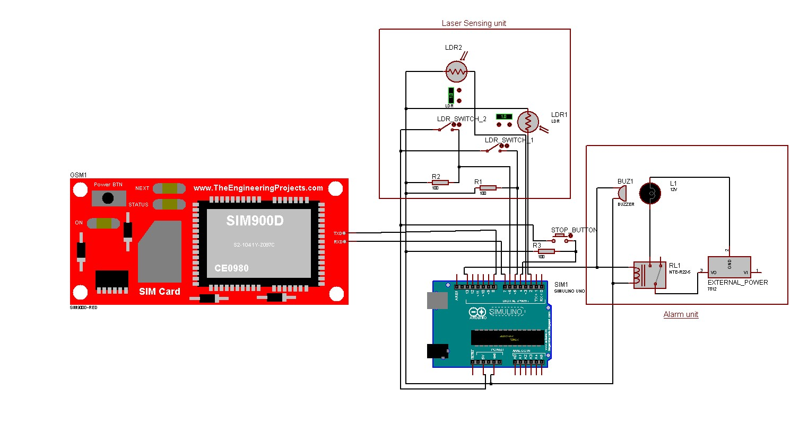
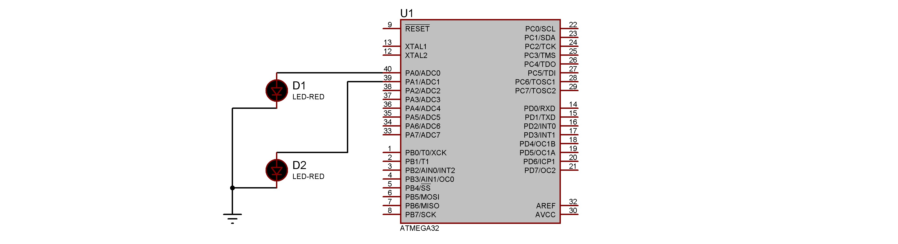

# Laser Security System With Arduino

## Introduction

This is a simple project to control a laser security system with an Arduino. The laser is controlled by an ATmega32 which enables the laser to blink at a certain rate. This laser is sensed by an LDR sensor from the other end and detects the rate at which the laser blinks. The LDR sensor is connected to the Arduino which controls the alarm system. Whenever someone interrupts the laser, the Arduino does the following:
- Turns the buzzer on
- Turns the red light on
- Sends an SMS to the owner
- Calls the owner

The alarm can be turned off by pressing the push button on the Arduino. There are switches to turn off the security of any specific edge of the boundary.

## How to reconstruct the project
### Required Hardwares (One unit)
- Arduino (Recommended - Arduino Uno)
- ATmega32
- GSM module (Recommended - SIM900)
- Laser
- LDR (Recommended - LDR module)
- Buzzer
- Red light
- Relay module
- Push Button
- SPST swithches
- Power adapter (output 5V, 2A)
- USB cable
- Wires

### Required Softwares
- [Arduino IDE](https://www.arduino.cc/en/software)
- [Microchip Studio](https://www.microchip.com/en-us/tools-resources/develop/microchip-studio)
- [Extreme burner](https://extreme-burner-avr.software.informer.com/download/)

### Setting up Arduino
- Download the project.
- Open the Arduino IDE, connect your Arduino to your computer and upload the sketch [laser_security_system.ino](https://github.com/fardinanam/Laser-Security-System-With-Arduino/blob/main/alarm_unit/laser_security_system.ino).
- Now connect the following components to the Arduino as follows:
    - **LDR**: `D0` of LDR1 (LDR module) to `pin 3`. `D0` of LDR2 to `pin 2`. `VCC`s of both the LDRs to Arduino's `5V`. `GND`s of both the LDRs to Arduino's `GND`. 
    
        `Note`: The LDR connection described above is for LDR module. For more details, see the [documentation](https://create.arduino.cc/projecthub/electronicsfan123/interfacing-arduino-uno-with-ldr-8760ba).
    - **Buzzer**: `VCC` to `pin 13` and `GND` to the `GND` of Arduino. You can also connect it to the relay if you want a better buzzer that requires higher voltage. 
    - **Red Light**: Relay modules' `IN` to `pin 13` parallely with buzzer. `VCC` and `GND` of the relay module should be connected to Arduino's `5V` and `GND`. `COM` of the relay module to external power's `+` end and the `NC` of the relay module to the red light's `+` end. The red light's `-` end should be connected to the `-` end of the external power directly. For more details, see the [documentation](https://randomnerdtutorials.com/guide-for-relay-module-with-arduino/).
    - **Push Button** One end of the stop button (push button) to `pin 4` and the other end to the `5V` pin. Note that the end which is connected to pin 4 must be connected with a pull-down resistor as shown in the image below.
    - **Switches**: One end of both the SPST switches should be connected to the `5V` of Arduino and the other ends to `pin 5` and `pin 6`. These also require pull-down resistors as like as the push button. 
    - **GSM module**: `TX` pin of the GSM module to `pin 8` and `RX` pin of the GSM module to `pin 7`. `GND` of the GSM module to `GND` of Arduino. The power port's `VCC` and `GND` of the SIM900 should be connected to the `VCC` and `GND` of the adapter.

        `Note`: The GSM module requires the current supply to be 2A. So, an appropriate power adapter is required.

    

### Setting up the lasers
- Open Microchip studio and open [laser_unit.cproj](https://github.com/fardinanam/Laser-Security-System-With-Arduino/blob/main/laser_unit/laser_unit/laser_unit.cproj).
- Build the project.
- Connect an ATmega32 using a USBASP programmer.
- Open Extreme Burner.
- Open the `.hex` file created in the `laser_unit\Debug` folder by Microchip studio. Then burn it to the ATmega32.
- Now connect the following components to the ATmega32 as follows:
    - It is recommended to use an adapter to power the ATmega32 as the security system should be turned on all the time. So connect the `pin 10 (VCC)` of the ATmega32 to the `VCC` of the adapter and the `pin 11 (GND)` of the ATmega32 to the `GND` of the adapter.
    - The positive `+` ends of the laser to ATmega32's `pin 40 (A0)` and `pin 39 (A1)`. And the negative `-` ends to the ground of the power system.

    

## How to use the project
Every unit of the alarm system has two LDR sensors, which means one unit can secure two edges of the boundary. So a total of 2 units are required to secure a boundary of rectangular shape.
The same is the case for the laser unit. See the image below for a better understanding.

## Problems faced and how we have solved them

## Contributors
- [Fardin Anam Aungon](https://github.com/fardinanam)
- [Kazi Ababil Azam](https://github.com/ababiltalha)
- [Sumaiya Sultana Any]()